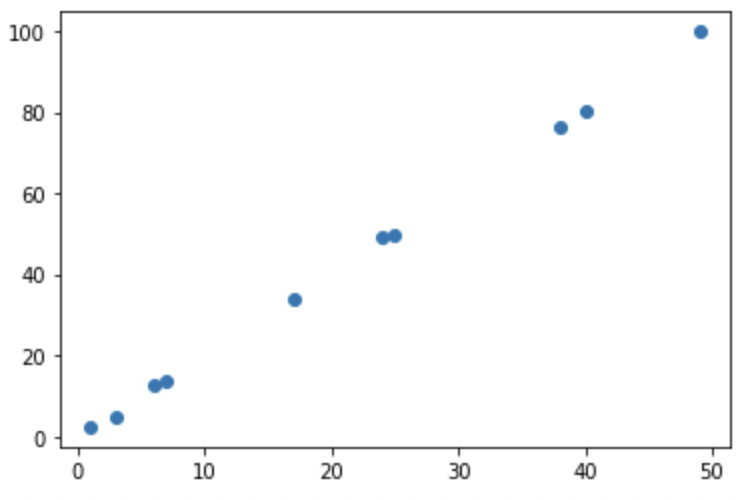

# How to Play the PCA Game
tags: [PCA, EigenGame]
authors: Shilin Ma, Xiaoyue Cui, Zicheng Cai

## Introduction
The paper <em>EigenGame: PCA as a Nash Equilibrium</em> was published at ICLR 2021. The authors, Ian Gemp, Brian McWilliams, Claire Vernade, and Thore Graepel, introduced a decentralized algorithm for PCA via a game-theoretic analysis. Not only is the approach novel, but the algorithm also has amazing scalability -- able to perform PCA on ResNet-200 activations!

In short, the paper shows that with the right utility functions, PCA is the same as finding the Nash equilibrium.

Below we will first review ideas central to the paper, then motivate and explain the algorithms, and finally, we'll highlight three takeaways from the paper.
### Background
#### PCA
PCA stands for Principal Component Analysis. It is a widely used technique for dimension reduction and data visualization. The goal of PCA is to find a lower-dimensional representation of the raw data. This is typically done by minimizing the reconstruction error.

There are two assumptions of PCA. One is linearity: the data can be mapped to a linear subspace. The other is orthogonality: the principal components (the basis of the linear subspace) are orthogonal.

Using these assumptions, traditionally, we can select the top eigenvectors of the covariance matrix of raw data as the principal components. To find the low dimensional representation, we simply put the principal components into a projection matrix and multiply the projection matrix with the raw data.

Consider the data:
<table>
  <thead>
    <tr>
      <th>x</th>
      <th>y</th>
    </tr>
  </thead>
  <tbody>
    <tr>
      <td>7</td>
      <td>13.486</td>
    </tr>
    <tr>
        <td>1</td>
        <td>2.381</td>
    </tr>
    <tr>
        <td>24</td>
        <td>49.282</td>
    </tr>
    <tr>
      <td>49</td>
      <td>99.855</td>
    </tr>
    <tr>
      <td>25</td>
      <td>49.888</td>
    </tr>
    <tr>
      <td>40</td>
      <td>80.299</td>
    </tr>
    <tr>
      <td>3</td>
      <td>4.716</td>
    </tr>
    <tr>
      <td>6</td>
      <td>12.749</td>
    </tr>
    <tr>
      <td>17</td>
      <td>34.075</td>
    </tr>
    <tr>
      <td>38</td>
      <td>76.412</td>
    </tr>
  </tbody>
</table>
Generated by $y = 2x + noise$, which looks like 
So, the covariance matrix is $$\begin{bmatrix} 703 & 1420.52\\ 1420.52 & 2870.88\end{bmatrix}.$$
The two eigenvalues of this covariance matrix are 3573.78 and 0.098. 
The eigenvectors corresponding to the largest and second-largest eigenvalue are $\begin{bmatrix} 0.443 \\ 0.896 \end{bmatrix}^{\top}$ and $\begin{bmatrix} -0.896 \\ 0.443 \end{bmatrix}^{\top}$, respectively. 
Observe that the first principal component captures the direction of maximum variance (it is roughly parallel to $y=2x$), and the two principal components are orthogonal unit vectors.

#### Nash Equilibrium
The Nash Equilibrium of a game is the outcome of the strategies that each player chooses when they are aware of the equilibrium strategies of the other players. So, none of the players can increase their utility by only changing their own strategy. 

A famous example for understanding the Nash equilibrium is the Prisoner's Delima: 
<table>
  <thead>
    <tr>
      <th> </th>
      <th>A-Confess</th>
      <th>A-Deny</th>
    </tr>
  </thead>
  <tbody>
    <tr>
      <td>B-Confess </td>
      <td>(-3,-3)</td>
      <td>(-10,-1)</td>
    </tr>
    <tr>
      <td>B-Deny</td>
      <td>(-1,-10)</td>
      <td>(-2,-2)</td>
    </tr>
  </tbody>
</table>
In the matrix above, each pair (a,b) represents the pay-off that A receives utility a and B receives utility B. In this game, (-3,-3) is a Nash equilibrium because if either player changes their strategy from "confess" to "deny" while the other player still confesses, then their utility payoff decreases from -3 to -10. Moreover, this is the unique Nash equilibrium of the game, since in all other strategy combinations, at least one player is denying, and that player could increase the payoff by confessing. 

## PCA as an Eigen-Game
### 2-in-1 Objective
We start the analysis by thinking about the covariance matrix $ M = X^{\top} X $ and considering its eigendecomposition. If $V$ is a matrix of the orthonormal eigenvectors of $ M $, then $ MV=V\Lambda $ where $ \Lambda$  is diagonal. Hence, $$V^{\top}MV = V^{\top}V\Lambda=\Lambda$$. Now, take $\hat{V}$ to be an estimation of $ V $, and define $ R(\hat{V}) $ to be $ \hat{V}^{\top}M\hat{V} $ then the equation above inspires the objective of minimizing the off-diagonal terms of $ R(\hat{V}) $, which can be expressed mathematically as 

$$ \begin{equation}\min_{\hat{V}^{\top}\hat{V}=I}\sum_{i\neq j}R_{ij}^2. \end{equation} $$

Note that this objective is satisfied as long as $\hat{V}$ is composed of orthonormal eigenvectors, regardless of their order or the corresponding eigenvalues.

Recall from the discussion of PCA above, one objective is to minimize the reconstruction error. The reconstruction of $X$ from $X\hat{V}$ is $X\hat{V}\hat{V}^{\top}$, so the square of the reconstruction error is $$ \|X-X\hat{V}\hat{V}^{\top} \|^2. $$

$$
\begin{align*}
\|X-X\hat{V}\hat{V}^{\top}\|^2 &= tr((X-X\hat{V}\hat{V}^{\top})(X-X\hat{V}\hat{V}^{\top})^{\top})\\
&= tr((X-X\hat{V}\hat{V}^{\top})(X^{\top}-\hat{V}\hat{V}^{\top}X^{\top}))\\
&= tr(XX^{\top})-2tr(X\hat{V}\hat{V}^{\top}X^{\top}) + tr(X\hat{V}\hat{V}^{\top}\hat{V}\hat{V}^{\top}X^{\top})\\
&= tr(XX^{\top})-2tr(X\hat{V}\hat{V}^{\top}X^{\top}) + tr(X\hat{V}\hat{V}^{\top}X^{\top})\\
&= tr(XX^{\top})-tr(X\hat{V}\hat{V}^{\top}X^{\top})\\
&= tr(M) - tr(\hat{V}^{\top}X^{\top}X\hat{V})\\
&= tr(M) - tr(\hat{V}^{\top}M\hat{V})\\
&= tr(M) - tr(R(\hat{V}))
\end{align*}
$$

Since $tr(M)$ depends only on $X$, minimizing the reconstruction error is equivalent to maximizing the trace of $R$. This objective can be expressed as 

$$\max_{\hat{V}^{\top}\hat{V}=I} tr(R(\hat{V}))= \max_{\hat{V}^{\top}\hat{V}=I} \sum_{i} R_{ii}.$$

This objective helps find the subspace spanned by the top eigenvectors, but does not recover the actual eigenvectors.

Seeing that the strength of the two objectives complement each other, it is natural to propose a two-in-one objective 

$$\max_{\hat{V}^{\top}\hat{V}=I}\sum_i R_{ii} - \sum_{i\neq j} R^2_{ij}$$

As we'll see below, this objective can be improved as well.
### Eigenvector Hierarchy
Because we would like an ordered list of the principal components, each column of $\hat{V}$ should have different interpretations, but that distinction is lacking in the objective above. For example, we would like the first column of $\hat{V}$, $\hat{v_1}$, to be the direction of the largest eigenvector, but the current objective penalizes $\hat{v_1}$ for aligning with $\hat{v_2}$. Similarly, for $\hat{v_2}$, it makes sense that $\hat{v_2}$ is penalized for aligning with $\hat{v_1}$, but $\hat{v_2}$ should be free to capture the variance independent of $\hat{v_3}$. For each $i>1$, $\hat{v_i}$ should depend on its parents, $\hat{v_1},\cdots,\hat{v_{i-1}}$. We denote the parents of $\hat{v_i}$ by $\hat{v}_{j < i}$. This hierarchy of eigenvectors prompts the assignment of different utility functions for each $\hat{v_i}$.

The Eigenvector hierarchy visualized for the top-5 eigenvectors:

### Utility Function
Starting with $\hat{v_1}$. Since $\hat{v_1}$ should be independent of the other eigenvectors, we might as well take $\hat{V}$ to be $\hat{v_1}$. Then $R(\hat{V})=\langle \hat{v_1}, M\hat{v_1}\rangle$. Because there is no off-diagonal term, we simply maximize $\langle \hat{v_1}, M\hat{v_1}\rangle$ for $\hat{v_1}^{\top}\hat{v_1}=1$, and this is the utility function for $\hat{v_1}$.

For $ i>1 $, given $ \hat{v}_{j < i} $, the utility function for $ \hat{v_i} $ is 

$$
\begin{equation}
u(\hat{v_i})=\hat{v_i}^{\top} M \hat{v_i} - \sum_{j < i} \frac{(\hat{v_i}^{\top} M \hat{v_j})^2}{\hat{v_j}^{\top} M \hat{v_j}} = \|X\hat{v_i}\|^2 - \sum_{j < i}\frac{\langle X\hat{v_i},X\hat{v_j}\rangle ^2}{\langle X\hat{v_j}, X\hat{v_j}\rangle}
\end{equation}
$$

(For more details, see section L of the paper)

The spirit of the utility function follows from the two-in-one objective, and the off-diagonal terms are scaled so that the gradient of the utility function has intuitive mathematical meanings:

The gradient for player $\hat{v_i}$ is 

$$2M\left[ \hat{v_i} -\sum_{j < i}\frac{\hat{v_i}^{\top}M\hat{v_j}}{\hat{v_j}^{\top}M \hat{v_j}}\hat{v_j} \right]=2X^{\top}\left[ X\hat{v_i} -\sum_{j < i}\frac{\langle X\hat{v_i}, X\hat{v_j}\rangle}{\langle X\hat{v_j}, X\hat{v_j}\rangle}X\hat{v_j} \right]$$

This can be interpreted as performing a generalized Gram-Schmidt step and then applying techniques used in other successful methods for PCA.

### EigenGame
Using these utility functions, it remains to show that the eigenvectors are the unique Nash equilibrium of the game. Below is a sketch of the proof.

First, introduce the following assumption: the eigenvalues for the eigenvectors we seek are positive and distinct. Then, we again start the analysis with $\hat{v_1}$. Because $u(\hat{v_1})$ does not depend on the other $\hat{v_i}$'s and $ \langle \hat{v_1}, M\hat{v_1}\rangle = \frac{\langle \hat{v_1}, M\hat{v_1}\rangle}{\langle \hat{v_1}, \hat{v_1}\rangle} = \Lambda_{11}$ is maximized when $\Lambda_{11}$ is the largest eigenvalue. This shows that $\hat{v_1}$ would not deviate from the eigenvector corresponding to the largest eigenvalue.

For $i > 1$, since the true eigenvectors form a basis for the data (by the Spectral Theorem), let $d$ be the dimension of the data, let $\hat{v_i}$ be a linear combination of the true eigenvectors. So $\hat{v_i}=
\sum_{p=1}^d w_p v_p$ where $ \|\| w \|\| = 1$. Then,

$$
\begin{align}
u(\hat{v_i}) = \sum_{p\geq i} \Lambda_{pp}w_p^2
\end{align}
$$

So, maximizing the utility function can be seen as a linear optimization problem over the simplex, and the optimization problem has unique solutions up to a sign change. This makes sense because $v_i$ and $-v_i$ are both principal components. Therefore, if $\hat{v_i}$ deviates from the Nash equilibrium, then the utility would only decrease. 

Therefore, using the utility functions defined above, PCA is equivalent to finding the Nash equilibrium.

### Algorithm
The EigenGame introduced above easily gives rise to a sequential algorithm that solves for each $v_i$ in order. This sequential algorithm provably converges to the principal components.

Needless to say, a sequential algorithm might not be suitable for large datasets with high dimensions. Observing that as the previous eigenvectors converge their values become relatively stable, the authors come up with a second, decentralized algorithm to speed up the calculations. The algorithm is decentralized in the sense that there is no master node, rather the worker nodes communicate according to the eigenvector hierarchy.

Here is the pseudo-code for the decentralized algorithm:

Given total iterations T and step size $\alpha$,

<dl>
  <dt>Initiallize the vectors by $\hat{v_i}\leftarrow v_i^0$ </dt>
  <dt>for t=1 to T do</dt>
  <dd>rewards $\leftarrow X\hat{v_i}$</dd>
  <dd>penalites $\leftarrow \sum_{j < i}\frac{\langle X\hat{v_i},X\hat{v_j}\rangle}{\langle X\hat{v_j},X\hat{v_j}\rangle}X\hat{v_j}$</dd>
  <dd>$\nabla \hat{v_i} \leftarrow 2X^{\top}$[rewards -penalities]</dd>
  <dd>$\nabla_{\hat{v_i}}^R \leftarrow \nabla\hat{v_i}-\langle \nabla\hat{v_i},\hat{v_i}\rangle \hat{v_i}$</dd>
  <dd>$\hat{v_i}\leftarrow$ normalize($\hat{v_i}+\alpha\nabla_{\hat{v_i}}^R$)</dd>
  <dd>broadcast $\hat{v_i}$</dd>
  <dt> return $\hat{v_i}$ </dt>
</dl>

## Takeaways
1. The authors combine two PCA objectives and take advantage of the natural hierarchy of the eigenvectors to create the utility function for each player. The objectives are (a) minimizing the off-diagonal entries and (b) maximizing the diagonal entries.

2. The combined objective helps ensure that the top eigenvectors are recovered in addition to the subspace they span, which is an advantage of this algorithm over some other PCA algorithms, such as Krasulina's.

3. Since there is a broadcast step in the decentralized algorithm, systems with fast interconnects are required for the algorithm to run efficiently.

## Citation
<a href="https://openreview.net/forum?id=NzTU59SYbNq"> Ian Gemp, Brian McWilliams, Claire Vernade, and Thore Graepel. EigenGame: PCA as a Nash Equilibrium. International Conference on Learning Representations, 2021.</a>